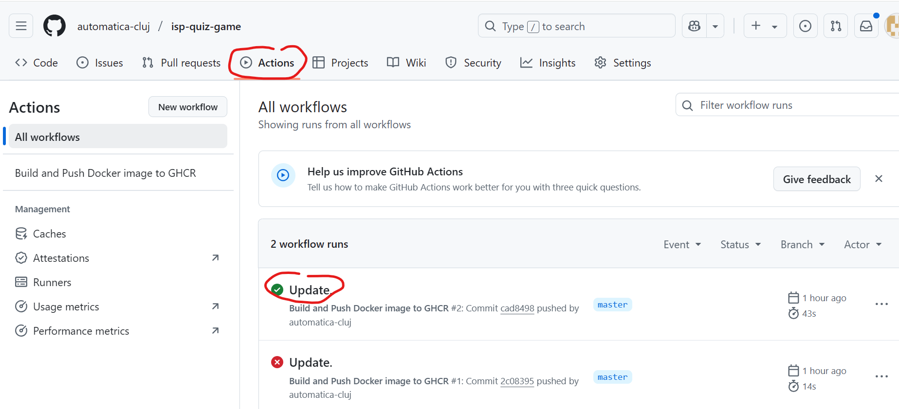
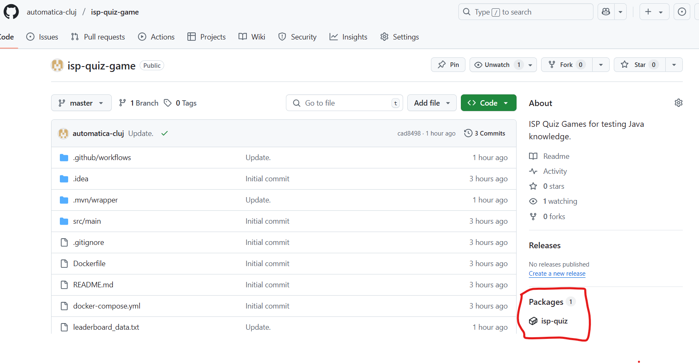
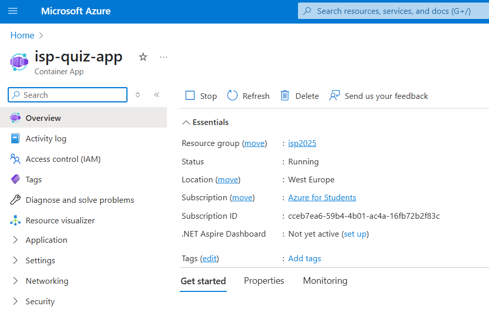

# ISP Quiz App

## Introduction 

This project is a sample application which implements a quiz like game where user has a limited time to answer some quiz questions. Game will end when user make a mistake or when time expires. 

## General Architecture

* **Backend:** The application is built with Java 21 using the Spring Boot framework. The main entry point is the `QuizApplication.java` class. The backend handles quiz logic, user sessions, and leaderboard management.
* **MVC Pattern:** The project follows the Model-View-Controller (MVC) pattern:
   * **Model:** Classes like `Question`, `QuizGame`, and `User` represent the core data structures.
   * **View:** HTML templates (e.g., `index.html`, `quiz.html`, `gameOver.html`) are used for rendering the UI.
   * **Controller:** The `QuizWebController` manages HTTP requests, user interactions, and navigation between views.
* **Service Layer:** Services such as `QuizSessionService`, `Leaderboard`, and `QuestionLoader` encapsulate business logic, quiz state management, and data loading.
* **Persistence:** Quiz questions and leaderboard data are stored in text files, which are loaded and managed by the service layer.
* **Build & Deployment:**
   * **Maven** is used for building the project and managing dependencies.
   * **Docker** is used for containerization, with a Dockerfile and support for Docker Compose.
   * **CI/CD** is set up with GitHub Actions to build and push Docker images to GitHub Container Registry (GHCR).
   * **Cloud Deployment:** The app can be deployed to Azure Container Apps using the Azure CLI.

## Build and Run with Docker

Bellow steps are optional and should be executed in case you want to run docker container on local machine. Alternatively you can run the application directly from IDE.

### Build the JAR

```sh
./mvnw clean package
```

### Build and Run with Docker Compose

```sh
docker compose up --build 
```

The app will be available at [http://localhost:8888](http://localhost:8888).

## Build and Run from IDE 

Load the project in your preffered IDE. Build the application from IDE and launching main class QuizApplication.java. 

## Build and Push Docker Image with GitHub Actions

This project uses GitHub Actions to automatically build a Docker image and push it to [GitHub Container Registry (GHCR)](https://ghcr.io). 

### How it works

1. On every push to the `main` branch, GitHub Actions runs a workflow defined in `.github/workflows/docker-ghcr.yml`.
2. The workflow:
    - Builds the Docker image using your `Dockerfile`
    - Logs in to GHCR using GitHub credentials
    - Pushes the image to `ghcr.io/<OWNER>/<REPO>:<TAG>`

### Example workflow

After code is pushed to master branch check Actions tab for the complition of the build:



Once build is complete you should find the newly generated container in ghcr. 



After a successful run, your image will be available at  
`ghcr.io/<OWNER>/<REPO>:latest`

## Deploy with Azure Container Apps (CLI)

To run the application in Azure using Container Apps, execute the following commands:

**NOTE** Bellow commands requires Azure CLI client to be installed on your computer.
**NOTE** It is assumed the container image is already pushed to ghcr and is public.

### 1. Create Resource Group
```bash
az group create --name cursIsp2025 --location westeurope
```
This command creates a new **Resource Group** in Azure:
- **Name:** `cursIsp2025` - This is the identifier for the resource group
- **Location:** `westeurope` - The Azure region where the resource group will be created
- **Purpose:** Resource groups are logical containers that hold related Azure resources for a solution. All Azure resources must belong to a resource group.

### 2. Create Container App Environment
```bash
az containerapp env create --name my-quiz --resource-group cursIsp2025 --location westeurope
```
This command creates a **Container App Environment**:
- **Name:** `my-quiz` - The name of the container environment
- **Resource Group:** `cursIsp2025` - Places this environment in the previously created resource group
- **Location:** `westeurope` - Same region as the resource group
- **Purpose:** A Container App Environment is the secure boundary around groups of container apps. Apps in the same environment share the same virtual network and write logs to the same Log Analytics workspace.

### 3. Create Container App
```bash
az containerapp create --name isp-quiz-app --resource-group cursIsp2025 --environment my-quiz --image ghcr.io/automatica-cluj/isp-quiz:latest --target-port 8888 --ingress external --transport http
```
This command creates the actual **Container App**:
- **Name:** `isp-quiz-app` - The name of your container app
- **Resource Group:** `cursIsp2025` - Places it in the same resource group
- **Environment:** `my-quiz` - Deploys it to the container environment created in step 2
- **Image:** `ghcr.io/automatica-cluj/isp-quiz:latest` - The Docker image from GitHub Container Registry
- **Target Port:** `8888` - The port your application listens on inside the container
- **Ingress:** `external` - Makes the app accessible from the internet (not just within the virtual network)
- **Transport:** `http` - Uses HTTP protocol for communication

### 4. Summary
These three commands work together to:
1. Set up a logical grouping for your Azure resources
2. Create a managed environment for running containerized applications
3. Deploy your quiz application from a Docker image, making it accessible via HTTP on the internet

### 5. Update Container App

To deploy a new version of your container image (e.g., a new latest tag or another tag) to your Azure Container App, you should use az containerapp update.

```sh
az containerapp update --name isp-quiz-app --resource-group cursIsp2025 --image ghcr.io/automatica-cluj/isp-quiz:latest
```

### 6. Update Container App

Stopping and starting the app can be done also via azure portal dashboard:


